Data fusion using Bayesian inference to predict behaviour of composite laminates subjected to multiaxial loading

Sinan Xiao^1^, Tobias Laux^2^, Janice M. Dulieu-Barton^2^, Karim Anaya-Izquierdo^1^

*^1^Department of Mathematical Sciences, University of Bath, Bath, BA2 7AY, UK*

*^2^Bristol Composites Institute, Faculty of Engineering, University of Bristol, Bristol, BS8 1TR, UK*

Abstract

Keywords

Bayesian statistics; Finite element analysis; Multiaxial experiments; Modified Arcan Fixture

1.  Introduction

Design and development programs for high-performance composite structures rely on integrated physical testing, model predictions, and model validation across the length scales, including at the coupon, subcomponent, and full structural scales \[[1](#_ENREF_1)\]. This methodology, referred to as the \'building block\' or \'testing pyramid\' approach, is designed to mitigate risk associated with the resource-intensive design processes of complex structures \[[2](#_ENREF_2)\]. Recent progress in the development of high-fidelity simulation frameworks for composite materials and structures, commonly based on the Finite Element (FE) method, have the potential to significantly accelerate the current design development approaches by reducing the reliance on time-consuming and costly physical tests at all levels of the testing pyramid \[[3-6](#_ENREF_3)\]. Efficient iteration between physical and virtual tests will be required to maximize experimental impact on modelling confidence and to minimize experimental effort, resulting in reduced cost of design and certification and time to market for new products. To this end, new data fusion and digital twinning approaches must be created and validated to support rapid and accurate inferences regarding structural performance \[[7](#_ENREF_7), [8](#_ENREF_8)\].

To devise a meaningful virtual test, a means of efficient model calibration is required, which can account for the uncertainties in the model and the experiment. To effectively deal with different types of uncertainty, Bayesian analysis has been used to statistically calibrate models of composite structures \[[9-11](#_ENREF_9)\]. In addition, incorporating probabilistic predictions in virtual twins could also be used to inform further physical tests and guide certification procedures. Probabilistic virtual twins based on modelling and integration of physical measurements through Bayesian fusion have been proposed for prognostic structural health monitoring of airframes \[[12-14](#_ENREF_12)\]. Bayesian fusion can effectively integrate heterogeneous information from different sources, e.g. prior engineering knowledge, experimental data, and model predictions.

In the present paper, an important first step towards a Bayesian fusion framework to streamline physical and virtual tests for the design and certification of complex structures is described. The proposed model is based on the Bayes' theorem \[[15](#_ENREF_15)\] and follows the approach in \[[16](#_ENREF_16)\]. A Gaussian Process (GP) \[[17](#_ENREF_17), [18](#_ENREF_18)\] is assigned as a prior for the unknown FE model outputs (apart from the limited FE model runs). An updated GP is obtained through Bayesian inference and used to make predictions that include associated probabilistic uncertainties of the mechanical response of composite specimens subjected to a range of different load cases. It should be noted that the model is capable of learning from new evidence, i.e. utilising newly available experimental data that can be integrated into the statistical model in a systematic manner. Hence, the Bayesian fusion framework can be used iteratively in design and development programs alongside virtual and physical testing to make informed decisions on the next most promising test (or model run). Hence, accelerating convergence to a validated structural design with minimum effort. Methodologies are developed and presented in the paper that address specific challenges associated with the fusion of experimental and simulation data obtained on complex composite structures. These include the relatively high prior uncertainty of material properties and material heterogeneity, and a means of dealing with restrictive assumptions made in defining the boundary conditions in the FE model that can lead to systematic discrepancies between the model and experiment. A hierarchical modelling approach is adopted by introducing latent random biases to account for the material heterogeneity across different specimens and the uncertainty in boundary conditions across different tests.

The Bayesian fusion methodology is demonstrated using specimens manufactured from multidirectional aerospace grade carbon fibre reinforced polymer (CFRP) with an open hole. The specimens were subjected to combined tension-shear and compression-shear loading within the linear part of the load response using a Modified Arcan Fixture (MAF) \[[19](#_ENREF_19)\], and full-field image displacement data was obtained using Digital Image Correlation (DIC) \[[20](#_ENREF_20)\]. The MAF/DIC approach has previously been used to assess the predictive capability of an advanced FE-based virtual testing framework for composite laminates and to assess combined lay-up and loading effects on the multiaxial and shear open-hole strengths \[[21-23](#_ENREF_21)\]. The MAF/DIC open-hole specimen test on a multidirectional composite provides a challenging means for validating and demonstrating the Bayesian fusion methodology as the mechanical behaviour of the specimens depend on both material properties as well as structural features and is thus difficult to predict without an FE model \[[24](#_ENREF_24)\]. Furthermore, the MAF offers an efficient means of applying different load cases to nominally identical specimens, thereby providing an analogue of different structural tests included in a typical aerostructures testing pyramid \[[2](#_ENREF_2)\]. \[Add more recent references from CMAME journal\]

The MAF experiment and associated FE model is briefly described in Section 2 of the paper. In Section 3, the fundamentals of the probabilistic model and the Bayesian fusion framework are discussed alongside specific modifications to account for material heterogeneity and uncertain specimen boundary conditions. The viability of the Bayesian statistical approach is demonstrated through a comparison of probabilistic model predictions with experimental data in Section 4. Finally, in Section 5, the Bayesian analysis results are discussed, and conclusions are drawn, which highlight the value of fusing of the experimental and model data using Bayesian statistics. It is demonstrated that the procedure enables a systematic understanding of the effect of material property and boundary condition uncertainties by identifying those that have most influence on the mechanical response of a component.

2.   Multiaxial MAF experiment and FE model

Multidirectional 8-ply quasi-isotropic \[+45/90/-45/0\]s specimens containing a central circular hole were constructed from unidirectional (UD) IM7/8552 carbon fibre reinforced epoxy prepreg, as shown in [Figure 1](#_Ref176785246).

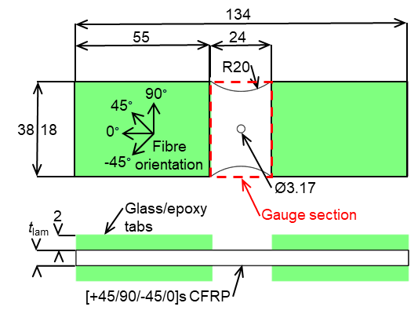{width="3.553472222222222in" height="2.6666666666666665in"}

[]{#_Ref176785246 .anchor}Figure 1. Specimen geometry and definition of fibre orientation.

The manufactured laminates have an overall thickness of *t*~lam~ = 2.09 mm with a Coefficient of Variation (CoV) of 1.29%, resulting in an average UD ply thickness of 0.29 mm. A more detailed description of the material system, specimen geometry, and manufacturing method can be found in \[[22](#_ENREF_22)\], \[[23](#_ENREF_23)\]. Multiaxial loading was applied to the specimen using the MAF installed on a universal tensile testing machine, as shown in [Figure 2](#_Ref150179145) (a), following the procedures described in \[[22](#_ENREF_22)\]. The MAF enables the application of the full combined tension/compression and shear loading envelope by the choice of the loading hole pair designated by the loading angle $\alpha$. Combined tension-shear $\alpha = 45^{\circ}$, shear $\alpha = 90^{\circ}$ from three specimens in each orientation, and compression-shear $\alpha = 135^{\circ}$ from two specimens was considered, as indicated in [Figure 2](#_Ref150179145) (a). Stereo DIC was employed to obtain the complex deformations induced in the specimens with the MatchID image acquisition and processing system \[[25](#_ENREF_25)\]. DIC was used as a virtual biaxial extensometer, as shown in Figure 2 [(b)]{.mark}, where the apparent normal and shear deformation is extracted from the vertical ($v$) and horizontal ($u$) displacement fields, respectively. Note that the camera set-up was rotated through 90^o^ relative to the rig, for the shear loading, and then ± $^{}$ according to the two other loading configurations. This allowed the camera sensors to view the specimen with the most efficient stereo angle, and provide the DIC data in the format shown in Figure 2 (b). Hence, the coordinate axis are the same regardless of the rotation of the specimen in the rig. The normal and shear extension $\mathrm{\Delta}v$ and $\mathrm{\Delta}u$ in Figure 2 (b) were obtained as the difference between a representative top edge ($v^{top},u^{top}$) and bottom edge ($v^{btm},u^{btm}$) displacement, where $v^{top},u^{top},\ v^{btm},u^{btm}$ were extracted from the DIC displacement fields 10 mm above and below the hole centre as the average across three squares of 2 × 2 DIC data points (or steps), as indicated in Figure 2 [(b).]{.mark} Note that the fields need to be corrected for rigid body motion before extraction of the top and bottom displacement, because the MAF rig kinematics and compliance (see Figure 2) induce a small but noticeable rigid rotation. This was done using a custom code that computes the best-fitting rigid transformation in the least-squares sense based on singular value decomposition \[[26](#_ENREF_26)\]. The normal and shear extensions extracted from the DIC were combined with the respective load component of the applied load, $P$, to obtain the normal and shear load-extension curves; the normal component of the load is $P_{y} = P\cos(\alpha)$, and the shear component of the load is $P_{x} = P\sin(\alpha)$.

The derived experimental load-extension curves used for the Bayesian analysis described in the following sections are shown in [Figure 3](#_Ref149141775). It can be observed that the normal extensions are tensile for $\alpha = 45^{\circ}$, close to zero for $\alpha = 90^{\circ}$, and compressive for $\alpha = 135^{\circ}$, representing the different applied load cases as expected. For the Bayesian analysis in Section [3](#_Toc133938870), the normal extensions and shear extensions are used in combination. However, it is assumed that the corresponding measurements are stochastically independent for simplicity. The load-extension curves included in the Bayesian analysis were truncated at $P = 10\ kN$ as the present paper is focused on the application of the Bayesian analysis to the elastic multiaxial response of multidirectional composite materials.

\].](media/media/image2.png){width="6.299212598425197in" height="3.186634951881015in"}

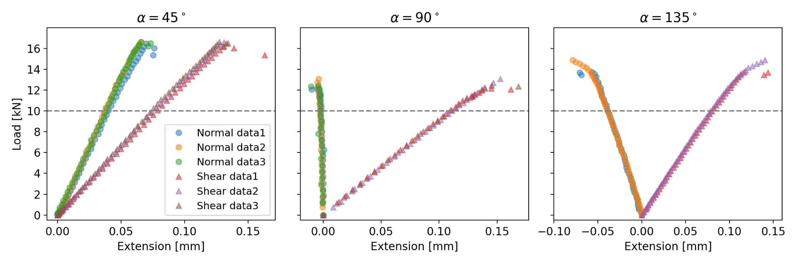{alt="A screen shot of a graph Description automatically generated" width="6.268055555555556in" height="2.089583333333333in"}

To predict the load-extension curves, FE models were constructed in the commercially available FE software Abaqus/Standard 2018 \[[27](#_ENREF_27)\] as shown in Figure 4. The model is described in detail in \[[23](#_ENREF_23)\], hence the following provides only a brief summary. Specimens were modelled using 3D solid elements (C3D8R), exploiting through-thickness symmetry. The MAF experimental boundary conditions were replicated using rigid beam links attached to reference points, corresponding with the MAF loading hole pairs for tension-shear, shear, and compression-shear loading (see Figure 2 (a)). The bottom reference node was fixed, while $P$ was applied to the top reference node. The specimens were meshed with an average in-plane element size of 0.25 × 0.25 mm and six elements through the thickness of each ply. For the prior predictions, each ply was assigned the material properties measured in \[[28](#_ENREF_28)\] and fibre orientation angles according to the specified laminate lay-up, as shown in Figure 1. The material properties, i.e. $E_{1}$ the Young's modulus in the ply fibre direction, $E_{2}_{}$, the Young's modulus in the ply transverse to the fibre direction, $G_{12}$ the in-plane shear modulus, $\nu_{12}\ $the in-plane Poisson's ratio, and$\ \nu_{23}\ $the out-of-plane Poisson's ratio, were parameterised in the ABAQUS input file assuming transverse isotropy of the UD ply ($E_{3} = E_{2},\ G_{13} = G_{12},\ v_{13} = v_{12}$, $G_{23} = E_{2}/(2\left( 1 + v_{23} \right))$). In addition, the loading angle $\alpha$ and the applied load $P$ were also parametrised to account for uncertainties related to experimental boundary conditions. The choice of prior material properties, informed by standard uniaxial coupon testing and representing the best set of model input parameters based on engineering knowledge, is discussed in Section 3.3. The parametrisation enabled efficient integration/fusion of the FE model predictions with the experimental data through the Bayesian analysis framework. The FE model predictions, which include the ply-by-ply deformations and stresses, were treated in the same manner as the experimental data to derive load-extension curves. The predicted FE displacement fields at the surface of the specimens were corrected for rigid rotations using the process described in \[[26](#_ENREF_26)\] followed by the procedure described above, and in [Figure 2](#_Ref150179145) (b), to obtain the load-extension behaviour.

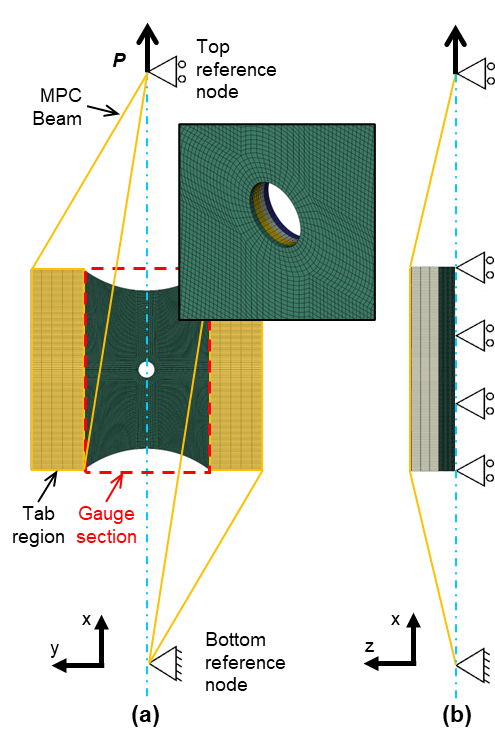{width="2.952755905511811in" height="4.42043416447944in"}

. FE model for the shear configuration (α=90°); (a) plan view with mesh detail at the hole, and (b) side view \[23\].

3.  []{#_Toc133938870 .anchor}Bayesian analysis

    1.  []{#_Toc133938871 .anchor}Basic framework of Bayesian inference

In Bayesian statistical inference, both aleatoric and epistemic uncertainties are manipulated equally as random variables following the laws of probability theory \[[29](#_ENREF_29)\]. The results from experiments, such as those described in the previous section, can be considered aleatoric as two nominally identical tests, i.e. specimens with the same nominal geometry, lay-up and dimensions loaded in the same way will return different results. However, the uncertainty in the quoted material properties of the specimens tested is of an epistemic nature because it is difficult to measure exactly and can be reduced with more experimental data. In the Bayesian framework, any uncertain quantities can be considered as random variables (denoted generically as $\mathbf{\theta}$**)** with corresponding probability distributions, called *prior distributions*, which comprise the prior knowledge about such quantities before observing any experimental data. The uncertain quantities $\mathbf{\theta}$ can include the input parameters of the FE model that are not known or cannot be determined with certainty. The prior Probability Density Function (PDF) $p(\mathbf{\theta})$ is the prior belief before the experimental results are obtained. Once the experimental data has been captured and processed, the corresponding results are denoted as $y$, then the posterior (updated) PDF, $p(\mathbf{\theta}|y)$, can be obtained using Bayes' Theorem:

+------------------------------------------------------------------------------------------------------------------------------------------------------------------------------------------------------+--------------------------------+
| $$p\left( \mathbf{\theta} \middle| y \right) = \frac{p\left( \mathbf{\theta} \right)p(y|\mathbf{\theta})}{p(y)} \propto p\left( \mathbf{\theta} \right)p\left( y \middle| \mathbf{\theta} \right).$$ | (1) []{#_Ref133931656 .anchor} |
+======================================================================================================================================================================================================+================================+

In Equation [(1)](#_Ref133931656), $p(y|\mathbf{\theta})$ is termed the *likelihood*, which provides the probability of the observed experimental results, $y$, when the uncertain parameters $\mathbf{\theta}$ are fixed. The likelihood quantifies the aleatoric uncertainty associated with the experimental results. The probability function $p(y)$ in Equation [(1)](#_Ref133931656) is a normalizing factor known as *marginal likelihood* or *Bayesian model evidence* and provides the uncertainty in $y$ by averaging across possible uncertain values of $\mathbf{\theta}$ \[[30](#_ENREF_30)\]. Since $p(y)$ is not a function of the parameters $\mathbf{\theta}$, the posterior PDF is fully characterized by the product in Equation [(1)](#_Ref133931656) between the prior $p(\mathbf{\theta})$ and the likelihood $p\left( y \middle| \mathbf{\theta} \right)$, as indicated by the proportionality in Equation [(1)](#_Ref133931656). Hence, Equation (1) provides the posterior PDF $p\left( \mathbf{\theta} \middle| y \right)$, which represents an updated knowledge of the uncertain parameters $\mathbf{\theta}$ based on the measured experimental data.

There are two types of input parameters in the FE model. The first type are the controllable parameters, which do not contain any error or uncertainty and are controlled (or fixed) in the corresponding experiments. For the experiments in the MAF, the applied load $P$ and the loading angle $\alpha$ were initially considered as controllable parameters. Clearly the controllable parameters do not require a prior probability. The second type of input parameters is the uncontrollable parameters denoted by $\mathbf{t}$, which are the uncertain parameters, here the material parameters $E_{1},\ E_{2},\ \nu_{12},\ \nu_{23}$ and $G_{12}$. There may be a small differences in the ply angles (\<1^o^) from the nominal values of \[+45/90/-45/0\]s cause by alignment errors during manufacture. However, the effect on the output will be small in comparison to the other uncertain material parameters have on the output, hence the ply angles are considered as fixed values. For a given input vector $\left( P,\alpha,\mathbf{t} \right),$ the load-extension curves predicted by the FE model are denoted by $\eta(P,\alpha,\mathbf{t})$, while the observed experimental load-extension curves are denoted as $y(P,\alpha)$. Hence, the load-extension curves can now be modelled statistically as:

+--------------------------------------------------------------------------------------------+--------------------------------+
| $$y(P,\alpha) = \eta\left( P,\alpha,\mathbf{t} = \mathbf{\tau} \right) + \varepsilon(P),$$ | (2) []{#_Ref134204163 .anchor} |
+============================================================================================+================================+

where $\mathbf{\tau}$ is the \"true\", but unknown, value of the uncontrollable parameters, and $\varepsilon(P)$ denotes the residual error which includes sources such as measurement error, FE model error and numerical error.

The residual error is assumed to be uncertain and therefore is modelled as a random variable following a Gaussian distribution with mean zero and variance $P\sigma_{\varepsilon}^{2}$. The zero mean is equivalent to assuming that the FE model provides an accurate average prediction of load-extension curves. The variance of the residual error is assumed to be linearly dependent on the load $P$ to account for any discrepancy between the FE model and the experimental load-extension curves. Here, the variance factor$\ \sigma_{\varepsilon}^{2}$ is unknown and therefore must be estimated. In more complex cases, where the FE model is unlikely to accurately represent the physical experiment, e.g. when failure is included, a modification with an additional discrepancy term can be used \[[16](#_ENREF_16)\].

Under the Bayesian framework, it is only necessary to apply Bayes theorem in equation [(1)](#_Ref133931656) to obtain the posterior probability distribution of the uncertain uncontrollable parameters $\mathbf{\tau}$ based on the experimental data $y(P,\alpha)$. Generally, the posterior distribution in Equation [(1)](#_Ref133931656) cannot be obtained analytically due to the complexity of the FE model. Therefore, the posterior distribution is obtained using the widely used Markov Chain Monte Carlo (MCMC) \[[31](#_ENREF_31), [32](#_ENREF_32)\] method. MCMC generates samples from a Markov chain, with a limit stationary distribution that matches the required posterior distribution. Reaching such a limit stationary distribution may require hundreds of thousands of iterations (i.e. FE model runs) to ensure convergence, which is computationally infeasible for the current FE model. For this reason, the FE model is evaluated only for a set of predefined input parameter values ${P_{i}^{*},\alpha}_{i}^{*},\mathbf{t}_{i}^{*}(i = 1,\text{…},m)$ that are specified by Latin hypercube sampling \[[33](#_ENREF_33)\]. This guarantees that the parameter values $P_{i}^{*}$ used are uniformly distributed in the interval $\lbrack 0,10\rbrack kN$ (as only experimental data below 10kN is considered) as well as ensuring the values of $\alpha_{i}^{*}$ are uniformly distributed in the interval $\lbrack 0,180\rbrack\deg$ covering the entire combined loading space of the MAF, as shown in [Figure 2](#_Ref150179145) (a). The values $\mathbf{t}_{i}^{*}$ are not uniformly distributed but sampled from the corresponding prior distribution of $\mathbf{\tau}$ described later in Section 4. The sample size for the FE model data was set at $m = 100$ and the corresponding FE model predictions are denoted by:

+------------------------------------------------------------------------------------------------+------+
| $$\eta\left( {P_{i}^{*},\alpha}_{i}^{*},\mathbf{t}_{i}^{*} \right),\ \ i = 1,\ldots,m = 100.$$ | (3)  |
+================================================================================================+======+

For values of $\left( P,\alpha,\mathbf{t} \right)$ that are not included in the set of 100 model runs, the FE model output $\eta\left( P,\alpha,\mathbf{t} \right)$ is treated as uncertain. This uncertainty is accounted for in the Bayesian framework by the specification of a prior probability distribution. Such uncertainty is epistemic as it is simply due to lack of knowledge and can be eliminated in the case when the FE model can be run quickly on demand \[[16](#_ENREF_16)\]. The Bayesian framework effectively uses the predetermined FE model runs as observed data to produce an updated (posterior) probability distribution of FE model output. A common choice for the prior probability distribution model of the unknown FE output function is the so-called Gaussian Process (GP) prior \[[17](#_ENREF_17), [18](#_ENREF_18)\]. To fully determine a GP, it is necessary to specify a mean function and a covariance function. The mean function represents a centred approximation of the unknown function, and the covariance function controls both the smoothness and the dispersion around the mean function. Usually, a constant prior mean function would be used. However, in this work, simple mechanical prior knowledge is incorporated, and the following prior mean function is adopted:

+------------------------------------------------------------------+--------------------------------+
| $$\mu(P,\alpha) = \beta P_{e},$$                                 | (4) []{#_Ref138327461 .anchor} |
+==================================================================+================================+

where $\beta$ is an unknown parameter to be inferred and $P_{e}$ is either taken as $P_{x} = P\sin(\alpha)$ for shear extension, or $P_{y} = P\cos(\alpha)$ for normal extension (see Figure 2). The linear mean function was chosen based on prior knowledge that the initial load response is approximately linearly proportional to the extensions.

Under the Bayesian framework, a probabilistic expectation can be obtained for the terms on both sides of Equation [(2)](#_Ref134204163) based on the GP prior for $\eta\left( P,\alpha,\mathbf{t} \right)$, as follows:

+-------------------------------------------------------------------------+------+
| $$\text{E}\left( y(P,\alpha) \right) = \mu(P,\alpha) = \beta P_{e}\ .$$ | (5)  |
+=========================================================================+======+

This is because the expectation of the residual error is equal to zero. Hence, the parameter $\beta$ represents the uncertain value of the expected compliance of MAF test specimens.

For the covariance function of the GP prior, the widely used squared exponential kernel function is adopted:

+-------------------------------------------------------------------------------------------------------------------------------------------------------------------------------------------------------------------------------------------------------------------------------------------------------------------------------------------------+--------------------------------+
| $$Cov\left( \left( P,\alpha,\mathbf{t} \right),\left( P',\alpha',\mathbf{t}' \right) \right) = \sigma_{\eta}^{2}\exp\left( - \left( \frac{P - P'}{\lambda_{\eta,P}} \right)^{2} - \left( \frac{\alpha - \alpha'}{\lambda_{\eta,\alpha}} \right)^{2} - \sum_{i = 1}^{n_{t}}\left( \frac{t_{i} - t_{i}'}{\lambda_{\eta,t_{i}}} \right) \right),$$ | (6) []{#_Ref133935867 .anchor} |
+=================================================================================================================================================================================================================================================================================================================================================+================================+

where $\sigma_{\eta}^{2}$ is the marginal variance of the GP, $\lambda_{\eta,*}$ is the vector with correlation lengths for each input parameter, $n_{t}\ $denotes the number of parameters in $\mathbf{t}$, and $t_{i}$ is the $i$th component of $\mathbf{t}$. The correlation length parameters $\lambda_{\eta,*}$ control the smoothness of the GP in each parameter dimension, i.e., large values of $\lambda_{\eta,*}$ will lead to smoother functions.

The covariance function given by Equation (6) will provide a sufficiently smooth representation of the unknown function. The new set of parameters generated from Equation (6) will be added to the list of parameters for which the Bayesian approach deals with the uncertainty and produces posterior distributions. Hence, the full set uncertain parameters $\mathbf{\theta}$ include the input parameters $\mathbf{\tau}$ from the FE model, the parameters $\mathbf{h}_{\mathbf{\eta}} = \left( \beta,\sigma_{\eta},\lambda_{\eta,*} \right)$ from the GP prior and the parameter $\sigma_{\varepsilon}$ from the residual error, so that the full set of uncertain parameters can be represented as $\mathbf{\theta} = (\mathbf{\tau},\mathbf{h}_{\eta},\sigma_{\varepsilon})$.

The data yet to be used in the Bayesian process are the experimental load-extension curves denoted by $\mathbf{y} = \left( y\left( P_{1},\alpha_{1} \right),\text{…},y\left( P_{n},\alpha_{n} \right) \right)^{T}$ and the FE model runs denoted by $\mathbf{\eta}^{*} = \left( \eta\left( {P_{1}^{*},\alpha}_{1}^{*},t_{1}^{*} \right),\ldots,\eta\left( {P_{m}^{*},\alpha}_{m}^{*},t_{m}^{*} \right) \right)^{T}$. These are accommodated in an $n + m$-vector $\mathbf{z} = \left( \mathbf{y}^{T},{\mathbf{\eta}^{*}}^{T} \right)^{T}$ with $(P_{1},\alpha_{1},\mathbf{\tau}),\ldots,(P_{n},\alpha_{n},\mathbf{\tau})$ corresponding to the first $n$ components and $\left( P_{1}^{*},\alpha_{1}^{*},\mathbf{t}_{1}^{*} \right),\ldots,(P_{m}^{*},\alpha_{m}^{*},\mathbf{t}_{m}^{*})$ corresponding to the last $m$ components. Based on the GP prior, the likelihood connecting the full data $\mathbf{z}$ and the uncertain parameters $\mathbf{\theta}$ can be represented as \[[16](#_ENREF_16)\]

+------------------------------------------------------------------------------------------------------------------------------------------------------------------------------------------------------------------------------------------------------------------------------------+--------------------------------+
| $${p\left( \mathbf{z} \middle| \mathbf{\theta} \right) \propto \left| \mathbf{\Sigma}_{\mathbf{z}} \right|^{- \frac{1}{2}}\exp\left( - \frac{1}{2}\left( \mathbf{z} - \mathbf{M}_{\eta} \right)^{T}\Sigma_{\mathbf{z}}^{- 1}\left( \mathbf{z} - \mathbf{M}_{\eta} \right) \right), | (7) []{#_Ref151991058 .anchor} |
| }{\mathbf{\Sigma}_{\mathbf{z}} = \mathbf{\Sigma}_{\eta} + \begin{pmatrix}                                                                                                                                                                                                          |                                |
| \mathbf{\Sigma}_{y} & 0 \\                                                                                                                                                                                                                                                         |                                |
| 0 & 0                                                                                                                                                                                                                                                                              |                                |
| \end{pmatrix},}$$                                                                                                                                                                                                                                                                  |                                |
+====================================================================================================================================================================================================================================================================================+================================+

where$\mathbf{\Sigma}_{\eta}$ is the covariance matrix obtained by applying Equation [(6)](#_Ref133935867) to each pair of the $n + m$ values $\left( P_{1},\alpha_{1},\mathbf{\tau} \right),\ldots,\left( P_{n},\alpha_{n},\mathbf{\tau} \right),\left( P_{1}^{*},\alpha_{1}^{*},t_{1}^{*} \right),\ldots,(P_{m}^{*},\alpha_{m}^{*},t_{m}^{*})$, $\Sigma_{y} = D_{n}\sigma_{\varepsilon}^{2}$ is the covariance matrix related to the residual error (where $D_{n}$ denotes the $n$-dimensional diagonal matrix with corresponding loads as the diagonal elements) and $\mathbf{M}_{\eta}$ is the mean vector obtained by applying Equation [(4)](#_Ref138327461) to the $n + m$ values $\left( P_{1},\alpha_{1} \right),\ldots,\left( P_{n},\alpha_{n} \right),\left( P_{1}^{*},\alpha_{1}^{*} \right),\ldots,(P_{m}^{*},\alpha_{m}^{*})$.

1.  []{#_Ref151992833 .anchor}Bayesian inference with latent bias

The experimental load-extension curves are obtained from eight different, but nominally identical, coupon specimens. Importantly, the statistical model in equation [(2)](#_Ref134204163) assumes the uncertain material parameters in $\mathbf{\tau}$ are common to all specimens, but this may not be the case as the individual specimens may contain specific but small material variability caused by local variations in fibre distribution and uncertainties in the manufacturing process. Hence, the possibility of heterogeneity in material properties across specimens is accounted for by using latent random variables. The random variables are defined as latent biases, with respect to an overall unknown mean that represents the true material property, which ideally should be uniform across all specimens. It is also important to consider the possibility that a latent bias exists in the applied loading angle $\alpha$ where a nominal intended loading angle might not be achieved, due to tolerances in the MAF and specimen misalignment. Therefore, a different uncertain bias is modelled for each specimen as latent random variables representing deviations from the intended nominal loading angle. The latent bias in the material properties is related to the uncontrollable parameters, while the loading angle bias is related to the controllable parameters. Hence, these two different biases must be accounted for separately in the statistical framework.

For the purposes of demonstration and computational efficiency, the material property latent bias is only included for the most sensitive material property, i.e. the property that has the largest effect on the predictions. To this end, and before the Bayesian analysis, a sensitivity analysis with the Elementary Effects (EE) method \[[34](#_ENREF_34)\] was conducted to assess the sensitivity of the predictions to all input material parameters. The EE analysis results are shown in [Figure 5](#_Ref150354493) where large mean values and standard deviations indicate high sensitivity. Figure 5 shows that the fibre longitudinal modulus $E_{1}$ is the most sensitive input parameter, both on the prediction of the normal and shear extension. This is expected as $E_{1}$ is an order of magnitude greater than $G_{12}$ and $E_{2}$ and any proportionate change in $E_{1}$ will therefore significantly affect the predicted apparent stiffness of the specimen. Consequently, a corresponding latent bias $b_{E_{1},i}$ ($i = 1,\ldots,n_{e}$) is added to the unknown true material property $E_{1}$ for each specimen. The probabilistic model for the latent bias is ${\widetilde{E}}_{1,i} = E_{1} + b_{E_{1},i},$ $\left( i = 1,\ldots,n_{e} \right)$ where ${\widetilde{E}}_{1,i}$ is a random variable modelling the material property in specimen $i$, $n_{e}$ denotes the number of specimens, and  $E_{1}$ is the true uncertain modulus in the population of all possible coupons.

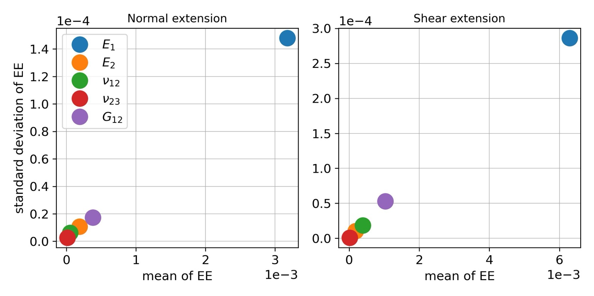{width="6.268055555555556in" height="3.134027777777778in"}

. Results of sensitivity analysis using the Elementary Effects (EE) method \[[34](#_ENREF_34)\].

As the latent biases are uncertain, prior distributions need to be assigned. It is assumed that the latent biases $b_{E_{1},i}$ $\left( i = 1,\ldots,n_{e} \right)$ are independent and identically distributed random variables following a Gaussian distribution with mean zero and choosing a narrow value for the standard deviation $\sigma_{b_{E_{1}}} = 1000\ MPa$. Their zero mean indicates that they are modelled as deviations with respect to true unknown modulus $E_{1}$. The predictions are not significantly influenced by the standard deviation of the latent biases $\sigma_{b_{E_{1}}}$, so it is assumed constant and set to a value based on prior engineering knowledge.

Including the uncertainty in the latent biases, the full Bayesian model becomes a hierarchical model with two levels. On the first level, the experimentally observed extensions are modelled conditionally on the latent biases $b_{E_{1},i}$ $\left( i = 1,\ldots,n_{e} \right)$, i.e., Equation [(2)](#_Ref134204163) can be modified as

+---------------------------------------------------------------------------------------------------------------------------------------------+------+
| $$y\left( P,\alpha|b_{E_{1},i} \right) = \eta\left( P,\alpha,\widetilde{\mathbf{\tau}} \right) + \varepsilon(P),\ \ i = 1,\ldots,\ n_{e},$$ | (8)  |
+=============================================================================================================================================+======+

where $\widetilde{\mathbf{\tau}}$ is obtained by $\mathbf{\tau}$ with $E_{1}$ replaced by ${\widetilde{E}}_{1,i}$. On the second level, the uncertain moduli are modelled as  ${\widetilde{E}}_{1,i} = E_{1} + b_{E_{1},i},$ $\left( i = 1,\ldots,n_{e} \right)$ described above.

The probabilistic model for latent bias in the loading angle (denoted here as $b_{\alpha,i}$, $i = 1,\ldots,n_{e}$) is given by ${\widetilde{\alpha}}_{i} = \alpha + b_{\alpha,i},$ $\left( i = 1,\ldots,n_{e} \right)$. ${\widetilde{\alpha}}_{i}$ is the random variable modelling the uncertain loading angle in specimen $i$ and $\alpha$ is the intended loading angle which, in contrast to $E_{1}$, is known as it is defined by the MAF set-up. Based on experience with the MAF, it is assumed that the loading angle latent biases $b_{\alpha,i}$ $\left( i = 1,\ldots,n_{e} \right)$ are independent and identically distributed following a Gaussian distribution with mean zero and standard deviation $\sigma_{b_{\alpha}} = 1\deg$. The consequent hierarchical model can be developed based on equation [(2)](#_Ref134204163) as follows:

+----------------------------------------------------------------------------------------------------------------------------------------------------+------+
| $$y\left( P,\alpha|b_{\alpha,i} \right) = \eta\left( P,{\widetilde{\alpha}}_{i},\mathbf{\tau} \right) + \varepsilon(P),\ \ i = 1,\ldots,\ n_{e}.$$ | (9)  |
+====================================================================================================================================================+======+

Uncertainty in both types of biases will influence the uncertainty in the measured load-extension curves; therefore, the extension measurements are dependent on the biases. Furthermore, the load-extension predictions will depend on the uncertainty in the biases which cannot be measured. The probabilistic operation to eliminate this uncertainty, is using a weighted average of all possible values of the biases is used based on their prior probability distribution, thus making the predictions probabilistically coherent \[[29](#_ENREF_29)\] .

1.  Choice of Prior distributions

For the input parameters in the FE model ($\mathbf{\tau}$), the transversely isotropic assumption is encoded into the prior. Priors of Gaussian distributions with mean and standard deviation values given by the measured material property values from \[[28](#_ENREF_28)\] are adopted. The priors for the FE model parameters in $\mathbf{\tau}$ are then given by

+-----------------------------------------------------------------------------------------+-------+
| $${E_{1}\lbrack MPa\rbrack \sim \text{Gaussian}\left( 148800,\ 2000^{2} \right),        | (10)  |
| }{\ \ E_{2}\lbrack MPa\rbrack \sim \text{Gaussian}\left( 9190,\ 100^{2} \right),        |       |
| }{G_{12}\lbrack MPa\rbrack \sim \text{Gaussian}\left( 5060,\ 70^{2} \right),            |       |
| }{\ \nu_{12}\lbrack - \rbrack \sim \text{Gaussian}\left( 0.34,\ {0.01}^{2} \right),\ \  |       |
| }{\nu_{23}\lbrack - \rbrack \sim \text{Gaussian}(0.44,\ {0.01}^{2}).}$$                 |       |
+=========================================================================================+=======+

The choice of the prior standard deviations in Equation (10) is based on the average value of the standard deviation obtained from DIC and strain gauge measurements in \[28\]. The choice is based on conservative prior knowledge due to the relatively large standard deviation of $E_{1}$ and can be considered subjective as it is related to the quality of the material property values available. Nevertheless, the conservative standard deviation values will provide a good test of the effectiveness of the Bayesian prediction reported in the later sections of the paper. A simplified approach is adopted where the prior probability distributions are specified separately for each uncertain parameter to account for the prior statistical independence of the parameters.

As discussed above, the uncertainty in the predicted FE extensions is modelled with the GP prior with mean and covariance functions provided in Section [3.1](#_Toc133938871). It is also required to set prior distributions for the uncertain parameter in the mean and covariance functions of the GP prior, usually called hyper-parameters, $\beta$. In the mean function of the GP prior, a prior of Gaussian distribution is adopted as

+-----------------------------------------------------------------------------------+---------------------------------+
| $$\ \beta\lbrack mm/kN\rbrack \sim \text{Gaussian}\left( 0,\ {0.01}^{2} \right)$$ | (11) []{#_Ref175582422 .anchor} |
+===================================================================================+=================================+

The mean in the prior distribution of $\beta$ is set to zero in Equation [(11)](#_Ref175582422) to show no prior preference for the positive or negative slopes in the mean function for all possible loading conditions. The standard deviation is set to 0.01 to make the prior distribution cover most common slope values in historical tests \[[22](#_ENREF_22)\].

For the standard deviation parameters $\sigma_{\eta}\ $and $\sigma_{\varepsilon}$, exponential prior distributions are assigned to reflect the belief that they are small and non-negative. Exponential distributions assign large probability close to zero and exponentially decaying probability as moving away from zero, following a principled approach of assigning priors called penalised-complexity priors \[[35](#_ENREF_35)\]. Specifically, the corresponding priors are assigned as follows:

+------------------------------------------------------------------+---------------------------------+
| $${\sigma_{\eta}\lbrack mm\rbrack \sim Exp(20),                  | (12) []{#_Ref175582493 .anchor} |
| }{\sigma_{\varepsilon}\lbrack mm\rbrack \sim Exp(100).}$$        |                                 |
+==================================================================+=================================+

Overall, the standard deviations values given in Equation [(12)](#_Ref175582493) control the amount of epistemic uncertainty in the FE model outputs, $\eta$, and the unobserved residual error, $\varepsilon$. It is assumed *a priori* that $\eta$ has larger variability than $\varepsilon$. Thus, the expected value for the prior of $\sigma_{\eta}$ is set as 0.05 and the expected values for the priors of $\sigma_{\varepsilon}$ is set as 0.01. For an exponential distribution, the rate parameter is the reciprocal of the mean, which means the corresponding rate parameters are 20 and 100.

For the correlation length parameters $\lambda_{\eta}$ in the GP prior, logNormal distributions are used as priors to ensure these parameters are not negative. The correlation length generally controls the smoothness of the GP as a response of changes in each input parameter. Usually, a very large or very small correlation length can limit GP performance. Therefore, the distribution parameters are chosen to give each correlation length parameter a moderate mean and variance. The priors are assigned the following values

+----------------------------------------------------------------------------------------------------+-------+
| $${\lambda_{\eta,P}\lbrack kN\rbrack \sim \text{LogNormal}\left( {1.5,0.5}^{2} \right),            | (13)  |
| }{\lambda_{\eta,\alpha}\lbrack rad\rbrack \sim \text{LogNormal}\left( {0.34,0.5}^{2} \right),      |       |
| }{\lambda_{\eta,E_{1}}\lbrack GPa\rbrack \sim \text{LogNormal}\left( {11,0.5}^{2} \right),         |       |
| }{\lambda_{\eta,E_{2}}\lbrack GPa\rbrack \sim \text{LogNormal}\left( {8.3,0.5}^{2} \right),        |       |
| }{\lambda_{\eta,G_{12}}\lbrack GPa\rbrack \sim \text{LogNormal}\left( {7.7,0.5}^{2} \right),       |       |
| }{\lambda_{\eta,\nu_{12}}\lbrack - \rbrack \sim \text{LogNormal}\left( - {0.8,0.5}^{2} \right),    |       |
| }{\lambda_{\eta,\nu_{23}}\lbrack - \rbrack \sim \text{LogNormal}\left( - {0.8,0.5}^{2} \right).}$$ |       |
+====================================================================================================+=======+

For the latent biases, as mentioned above, Gaussian priors with mean zero are adopted, i.e.,

+---------------------------------------------------------------------------------------------------------------------+-------+
| $$b_{E_{1},i}\lbrack MPa\rbrack \sim \text{Gaussian}\left( 0,\ 1000^{2} \right),\ \ i = 1,\ldots,n_{e}$$            | (14)  |
|                                                                                                                     |       |
| $$b_{\alpha,i}\left\lbrack \deg \right\rbrack \sim \text{Gaussian}\left( 0,\ 1^{2} \right),\ \ i = 1,\ldots,n_{e}$$ |       |
+=====================================================================================================================+=======+

Prior predictions of the load-extension curves for loading angles $\alpha = 45^{\circ},\ 90^{\circ},\ 135^{\circ}$ are shown in [Figure 6](#_Ref148871670) without accounting for any of the latent biases $b_{E_{1}}$ or $b_{\alpha}$. The dashed green lines denote prior mean predictions, while the green areas denote 95% probability bands for the prior predictions. The area size of these bands can be considered as a measure of uncertainty around the mean prediction and not as a measure of confidence in the usual frequentist sense (see in \[15\], \[29\] for more details). To obtain the prior predictions in Figure 6, only the predefined 100 FE model runs, described in Section 3.1, are used. Specifically, 5000 random samples of the uncertain parameters are obtained according to their prior distributions. For each of these samples, a realization is obtained from the conditional multivariate Gaussian distribution based on the 100 FE model runs \[[36](#_ENREF_36)\]. The prior mean is obtained as the average of these 5000 realizations and the 95% probability interval is obtained as the interval bounded by the 2.5th and the 97.5th percentile. The bands are relatively wide, which indicates there is significant uncertainty in the prior predictions. Also, the wavy nature of the band edges is due to the large degree of uncertainty in the prior distributions of uncertain parameters combined with the small amount of training data available due to the relatively high computational cost of the FE model. The prior predictions reflect the belief of the most likely load-extension behaviour of the MAF specimen based on the prior distributions of parameters and the FE model prediction without recourse to the MAF experimental data. By comparing the prediction in [Figure 6](#_Ref148871670) to the experimental data in [Figure 3](#_Ref149141775), it can be seen that the statistical model is already capable of predicting the general trends of mechanical shear and normal deformation as a function of the loading angle.

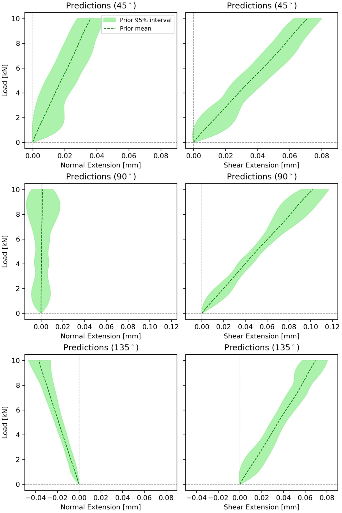{width="5.429346019247594in" height="8.14401902887139in"}

. Prior prediction of load-extension curves without latent bias.

With all prior distributions and the full likelihood in Equation [(7)](#_Ref151991058) defined, the Bayes theorem in Equation [(1)](#_Ref133931656) can be applied to integrate the information from the experiments, i.e. providing new evidence into the analysis to obtain the posterior (updated) distributions of the uncertain parameters. The posterior distributions can then be used to obtain predictions of load-extension curves of open-hole specimens subjected to combined tension/compression and shear loading.

4.  Results of the Bayesian analysis

Bayesian inference with MCMC is performed to obtain samples from the posterior distributions of the uncertain parameters and the posterior predictions of the load-extension curve. A state-of-the-art Hamiltonian Monte Carlo sampling algorithm \[[37](#_ENREF_37)\] is used, to take advantage of its higher convergence rate compared to the standard random walk MCMC algorithm \[[38](#_ENREF_38)\]. Specifically, the No-U-Turn sampler \[[39](#_ENREF_39)\] (an adaptive implementation of standard Hamiltonian Monte Carlo) implemented in the Python package NumPyro \[[40](#_ENREF_40), [41](#_ENREF_41)\] is used.

1.  []{#_Ref148889021 .anchor}Results with basic Bayesian inference framework (no latent bias)

[Figure 7](#_Ref148877125) shows both posterior (blue) and prior (green) Probability Density Functions (PDFs) of the physical parameters in the FE model based on the basic framework described in section 3.1. The most striking feature is that the posterior distribution of $E_{1}$ noticeably differs from its prior distribution, in parti cular, the posterior mean value is a little higher than the prior one (see Table 1), while the prior and posterior distributions are similar for the other material parameters $E_{2},\ \nu_{12},\ \nu_{23}$, and $G_{12}$. $_{}$When the posterior distribution is different from the prior, some learning has been acquired about the parameter in question. Importantly here the learning has been achieved by the integration of the experimental data with the FE model. The learning about $E_{1}$ is consistent with the outcome of the sensitivity (EE) analysis (Section 3.2) where $E_{1}$ was found to be the most sensitive parameter. This demonstrates that the Bayesian framework can be used to extract realistic material properties from integrated FE model predictions and experimental results.

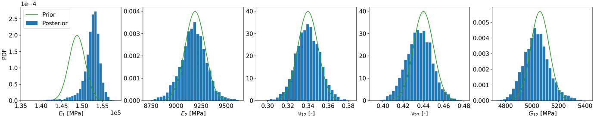{width="6.268055555555556in" height="1.2534722222222223in"}

. Posterior & prior distributions of physical parameters. Basic Bayesian inference framework (no latent bias).

+-----------------------+-----------------+-----------------+------------------+------------------+------------------+
| Parameter             | $E_{1}$ \[MPa\] | $E_{2}$ \[MPa\] | $\nu_{12}$ \[-\] | $\nu_{23}$ \[-\] | $G_{12}$ \[MPa\] |
+:=====================:+:===============:+:===============:+:================:+:================:+:================:+
| Posterior mean        | 152434 (2087)   | 9174            | 0.34             | 0.44             | 5035             |
|                       |                 |                 |                  |                  |                  |
| (standard deviation)  |                 | \(128\)         | (0.01)           | (0.01)           | \(95\)           |
+-----------------------+-----------------+-----------------+------------------+------------------+------------------+
| Prior mean            | 148800          | 9190            | 0.34             | 0.44             | 5060             |
|                       |                 |                 |                  |                  |                  |
| (standard deviation)  | \(2000\)        | \(100\)         | (0.01)           | (0.01)           | \(70\)           |
+-----------------------+-----------------+-----------------+------------------+------------------+------------------+

: . Posterior & prior statistics of physical parameters with the basic Bayesian inference framework.

The posterior and prior distributions of the hyper-parameters, $\beta$, $\sigma_{\eta}$ and $\lambda_{\eta,*}$ for GP prior and residual error $\sigma_{\varepsilon}$ are shown in [Figure 8](#_Ref148880465). Summary statistics of the posterior and prior hyper-parameters is provided in [Table 2](#_Ref148883971). The posterior distributions of the hyper-parameters are significantly different to the corresponding priors, indicating that the experimental data provides a substantial amount of new information . In particular, a substantial reduction in uncertainty is achieved for the hyper-parameters $\beta$, $\sigma_{\eta}$ and $\sigma_{\varepsilon}$ . The hyper-parameter $\beta$ can be interpreted as the expected compliance of the structure before undertaking conditional prediction with GP. $\sigma_{\eta}$, is the standard deviation of the GP, which controls the overall uncertainty of the GP and $\sigma_{\varepsilon}$ is proportional to the standard deviation of the residual error, which controls the uncertainty in the output measurement. The large amount of learning given by the relatively large discrepancy between prior and posterior distributions in [Figure 8](#_Ref148880465), is not unusual for an initial Bayesian analysis where little information is available to build the priors, meaning that the fusion of the experimental data into the model is an essential informative step. Potential further learning could be achieved by integrating future experimental data or conducting more FE model runs, and using the posterior distributions in [Figure 6](#_Ref148880465) as new priors. However, this could likely lead to the new posteriors being closer to the priors, meaning less learning, so has not been attempted in the present paper.

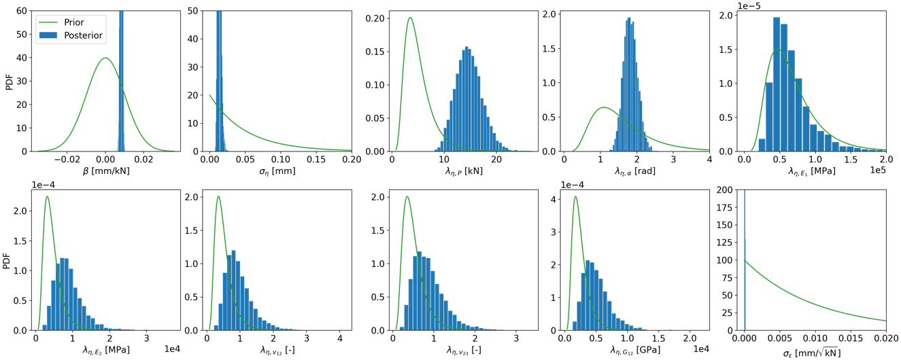{width="6.016128608923885in" height="2.4061843832021in"}

. Posterior & prior distributions of hyper-parameters for GP and residual error with the basic Bayesian inference framework (no latent bias).

<table>
<caption>
. Posterior &amp; prior statistics of hyper-parameters with the basic Bayesian inference framework.
</caption>
<colgroup>
<col style="width: 18%" />
<col style="width: 7%" />
<col style="width: 9%" />
<col style="width: 7%" />
<col style="width: 7%" />
<col style="width: 9%" />
<col style="width: 7%" />
<col style="width: 7%" />
<col style="width: 7%" />
<col style="width: 7%" />
<col style="width: 7%" />
</colgroup>
<thead>
<tr>
<th style="text-align: center;">Parameter</th>
<th style="text-align: center;">
<em>β</em>

[mm/kN]
</th>
<th style="text-align: center;">
<em>σ</em><em>η</em>

[mm]
</th>
<th style="text-align: center;">
<em>λ</em><em>η</em>, <em>P</em>

[kN]
</th>
<th style="text-align: center;">
<em>λ</em><em>η</em>, <em>α</em>

[rad]
</th>
<th style="text-align: center;">
<em>λ</em><em>η</em>, <em>E</em>1

[MPa]
</th>
<th style="text-align: center;">
<em>λ</em><em>η</em>, <em>E</em>2

[MPa]
</th>
<th style="text-align: center;">
<em>λ</em><em>η</em>, <em>ν</em>12

[-]
</th>
<th style="text-align: center;">
<em>λ</em><em>η</em>, <em>ν</em>23

[-]
</th>
<th style="text-align: center;">
<em>λ</em><em>η</em>, <em>G</em>12

[MPa]
</th>
<th style="text-align: center;">
<em>σ</em><em>ε</em>

[mm/$\sqrt{kN}$]
</th>
</tr>
</thead>
<tbody>
<tr>
<td style="text-align: center;">
Posterior mean

(standard deviation)
</td>
<td style="text-align: center;">
0.008

(4e-4)
</td>
<td style="text-align: center;">
0.013

(2.3e-3)
</td>
<td style="text-align: center;">
14.8

(2.54)
</td>
<td style="text-align: center;">
1.83

(0.19)
</td>
<td style="text-align: center;">
66588

(29132)
</td>
<td style="text-align: center;">
8895

(3842)
</td>
<td style="text-align: center;">
0.96

(0.41)
</td>
<td style="text-align: center;">
0.88

(0.39)
</td>
<td style="text-align: center;">
5107

(2172)
</td>
<td style="text-align: center;">
5e-5

(3e-5)
</td>
</tr>
<tr>
<td style="text-align: center;">
Prior mean

(standard deviation)
</td>
<td style="text-align: center;">
0

(0.01)
</td>
<td style="text-align: center;">
0.05

(0.05)
</td>
<td style="text-align: center;">
5

(2.7)
</td>
<td style="text-align: center;">
1.6

(0.85)
</td>
<td style="text-align: center;">
67845

(36158)
</td>
<td style="text-align: center;">
4560

(2430)
</td>
<td style="text-align: center;">
0.5

(0.27)
</td>
<td style="text-align: center;">
0.5

(0.27)
</td>
<td style="text-align: center;">
2502

(1334)
</td>
<td style="text-align: center;">
0.01

(0.01)
</td>
</tr>
</tbody>
</table>

Posterior predictions of load-extension curves can be obtained using the FE model $\eta\left( P,\alpha,\mathbf{t} = \mathbf{\tau} \right)$ for given values of $(P,\alpha)$ informed by the posterior samples of the uncertain parameters (including hyper-parameters) (see \[[17](#_ENREF_17)\] for details). These are shown in [Figure 9](#_Ref148885565) together with prior predictions given in Figure 6 for comparison.

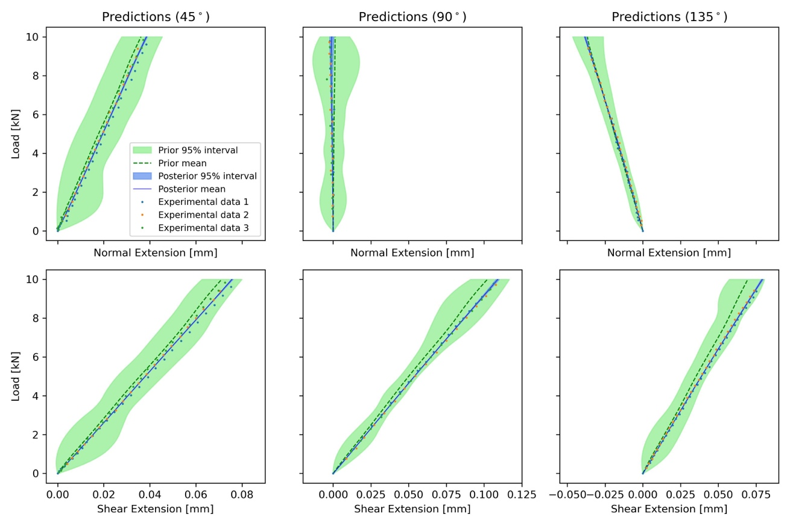{width="5.881720253718285in" height="3.920929571303587in"}

. Prediction of load-extension curves with the basic Bayesian inference framework (no latent bias). Prior predictions from Figure 6 are also included for comparison.

In [Figure 9](#_Ref148885565), it can be observed that the posterior mean lines (solid blue) are closer to the experimental data than the prior mean lines (dashed green). This indicates that the posterior prediction of extension is consistent with the experimental data after even integrating the prior information via Bayes' Theorem. This is mainly attributed to a reduction in predicted specimen stiffness, which aligns with the posterior likely values of $E_{1}\ $ being significantly smaller than those given by the prior, as illustrated in [Figure 7](#_Ref148877125). It can also be seen in Figure 9, that the posterior prediction has very small variance over the range of load values (e.g. narrow 95% probability band), which indicates that the uncertainty associated with the posterior predictions have been reduced compared to the corresponding prior predictions. This is consistent with the learning indicated in Figure 8. The main prediction differences are more precisely illustrated in Table 3, which shows a quantitative comparison between the prior and posterior predictions of extension in [Figure 9](#_Ref148885565). The first comparison is done first in terms of Root Mean Square Error (RMSE) between the mean extension predictions (prior or posterior) and the experimental data. The second comparison shown in Table 3, is between the area of the probability band (see Section 3.3) of the prior prediction (green) and the area of the posterior prediction (blue) in Figure 9. These two comparisons are complementary as the area of the probability band is a measure of uncertainty in the prediction *per se* and does not take the experimental data into account. The RMSE on the other hand, does not take into account the uncertainty of the prediction, only its mean and is computed with respect to the experimental data. In summary, Table 3 shows that the posterior predictions are closer to the experimental data than the prior predictions (RMSE reduced 693% on average). Moreover, the uncertainty in the posterior predictions is considerably smaller than around the prior predictions with the area reduced 97% on average, making it barely visible in [Figure 9](#_Ref148885565).

+--------------------------------------------------------------------------------------------------------------------------------------------------+-----------+-----------------------------------------------------+-----------------------------------------------------+
| Table 3. RMSE and probability area of the predictions for load-extension curves using the basic Bayesian inference framework (no latent bias).   |           | RMSE                                                | Probability area                                    |
+:================================================================================================================================================:+:=========:+:================:+:====================:+:=========:+:================:+:====================:+:=========:+
| Loading angle                                                                                                                                    | Extension | Prior prediction | Posterior prediction | Reduction | Prior prediction | Posterior prediction | Reduction |
|                                                                                                                                                  |           |                  |                      |           |                  |                      |           |
|                                                                                                                                                  |           |                  |                      |           |                  |                      |           |
+--------------------------------------------------------------------------------------------------------------------------------------------------+-----------+------------------+----------------------+-----------+------------------+----------------------+-----------+
| 45°                                                                                                                                              | Normal    | 0.016            | 0.0077               | 52%       | 0.179            | 0.0031               | 98%       |
|                                                                                                                                                  +-----------+------------------+----------------------+-----------+------------------+----------------------+-----------+
|                                                                                                                                                  | Shear     | 0.0222           | 0.0089               | 60%       | 0.1858           | 0.0016               | 99%       |
+--------------------------------------------------------------------------------------------------------------------------------------------------+-----------+------------------+----------------------+-----------+------------------+----------------------+-----------+
| 90°                                                                                                                                              | Normal    | 0.0149           | 0.0052               | 65%       | 0.1724           | 0.0085               | 95%       |
|                                                                                                                                                  +-----------+------------------+----------------------+-----------+------------------+----------------------+-----------+
|                                                                                                                                                  | Shear     | 0.0326           | 0.0057               | 83%       | 0.1832           | 0.0045               | 98%       |
+--------------------------------------------------------------------------------------------------------------------------------------------------+-----------+------------------+----------------------+-----------+------------------+----------------------+-----------+
| 135°                                                                                                                                             | Normal    | 0.0058           | 0.0038               | 34%       | 0.0906           | 0.0043               | 95%       |
|                                                                                                                                                  +-----------+------------------+----------------------+-----------+------------------+----------------------+-----------+
|                                                                                                                                                  | Shear     | 0.0348           | 0.0058               | 83%       | 0.171            | 0.0032               | 98%       |
+--------------------------------------------------------------------------------------------------------------------------------------------------+-----------+------------------+----------------------+-----------+------------------+----------------------+-----------+
|                                                                                                                                                  | Average   |                  |                      | 63%       |                  |                      | 97%       |
+--------------------------------------------------------------------------------------------------------------------------------------------------+-----------+------------------+----------------------+-----------+------------------+----------------------+-----------+

2.  Results of the Bayesian inference framework with latent bias $b_{E_{1}}$

The latent bias $b_{E_{1}}$, as described in Section 3.2, is added to the most sensitive material property $E_{1}$. Hence the basic Bayesian inference framework of Section [3.1](#_Toc133938871) is enhanced by accounting for material property variations across experimental specimens. It is important to distinguish the difference in interpretation between $E_{1}$, with and without latent bias. Without latent bias, $E_{1}$ reflects the uncertainty in the assumed common value of the material property in any possible experimental specimen. With latent bias, $E_{1}$ becomes the true (or average) material property across the population of experimental specimens, which, because of variability in the raw material and manufacturing process, can vary between actual specimens. The inclusion of the latent bias $b_{E_{1}}$ is done to explain the difference between prior and posterior seen in Figure 7. [Figure 10](#_Ref148888619) shows the posterior and prior distributions of the physical parameters but now accounting for the inclusion of the latent bias $b_{E_{1}}$. The corresponding posterior and prior summary statistics are also shown in [Table 4](#_Ref148888741). One of the main highlights is that the posterior distribution of the parameter $E_{1}$ is now considerably different and much less dispersed than the corresponding prior, indicating learning has been achieved about $_{}$. Compared to the results in Section [4.1](#_Ref148889021), the posterior mean of $E_{1}$ becomes slightly smaller. This also indicates that the difference between prior and posterior for $E_{1}$ observed in Figure 7 can be partly explained by the latent bias $b_{E_{1}}$ alone, and that the prior belief of the $E_{1}$ value is not fully consistent with the experimental data.

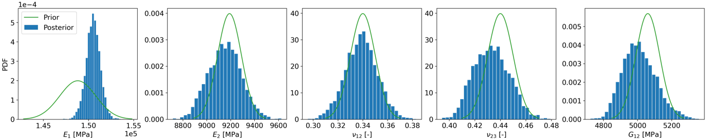{width="5.725805993000875in" height="1.1450339020122484in"}

. Posterior & prior distributions of physical parameters with latent bias $b_{E_{1}}$.

+------------------------+-----------------+-----------------+------------------+------------------+------------------+
| Parameter              | $E_{1}$ \[MPa\] | $E_{2}$ \[MPa\] | $\nu_{12}$ \[-\] | $\nu_{23}$ \[-\] | $G_{12}$ \[MPa\] |
+:======================:+:===============:+:===============:+:================:+:================:+:================:+
| Posterior mean         | 150499          | 9151            | 0.34             | 0.43             | 5012             |
|                        |                 |                 |                  |                  |                  |
| (standard deviation)   | \(787\)         | \(138\)         | (0.01)           | (0.01)           | \(98\)           |
+------------------------+-----------------+-----------------+------------------+------------------+------------------+
| Prior mean             | 148800          | 9190            | 0.34             | 0.44             | 5060             |
|                        |                 |                 |                  |                  |                  |
| (standard deviation)   | \(2000\)        | \(100\)         | (0.01)           | (0.01)           | \(70\)           |
+------------------------+-----------------+-----------------+------------------+------------------+------------------+

: . Posterior & prior statistics of physical parameters with latent bias $b_{E_{1}}$

The posterior distributions of the hyper-parameters are similar to those shown in Section [4.1](#_Ref148889021), thus they are not shown again here. In terms of the latent biases $b_{E_{1}}$, there are 8 of them, one for each tested specimen. Since these biases are treated as uncertain variables, their posterior distribution can be obtained so that it includes an updated information of their value after combining experimental data with the FE model runs. The posterior and prior distribution of the latent biases $b_{E_{1}}$is shown in Figure 11. The prior distributions of the biases all have a mean of zero indicating no *a priori* bias on average. The posterior distributions of the latent biases all overlap with the prior distributions, but with differing means in all cases, indicating differences in the material property value $E_{1}$ for each specimen. For example, the posterior distribution of $b_{E_{1},1}$ is on the negative part of the axis, and the posterior distribution of $b_{E_{1},3}$ is on the positive part. This indicates that the unknown population (average) value of $E_{1}$ is larger than the one corresponding to the first specimen and smaller than the one corresponding to the third specimen; posterior summary statistics of the latent biases $b_{E_{1}}$ is also shown in [Table 5](#_Ref148891248).

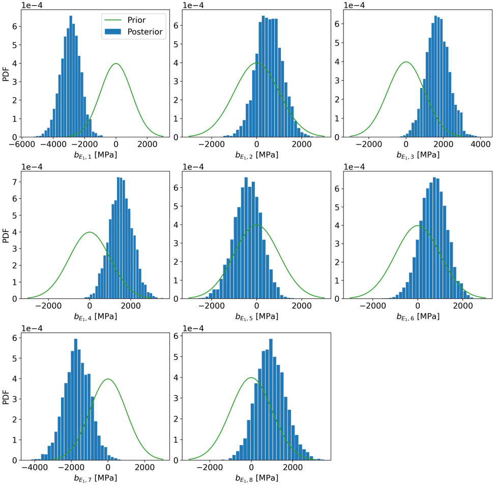

[]{#_Ref148891248 .anchor}\*\*\*

+----------------------+-------------------------------------------------------+---------------------------------------------------------------+-----------------------------------------------+
|                      | $$\alpha = 45^{\circ}$$                               | $$\alpha = 90^{\circ}$$                                       | $$\alpha = 135^{\circ}$$                      |
+:====================:+:=============:+:=====================:+:=============:+:=============:+:=====================:+:=====================:+:=====================:+:=====================:+
| Parameter            | $b_{E_{1},1}$ | $b_{E_{1},2}$ \[MPa\] | $b_{E_{1},3}$ | $b_{E_{1},4}$ | $b_{E_{1},5}$ \[MPa\] | $b_{E_{1},6}$ \[MPa\] | $b_{E_{1},7}$ \[MPa\] | $b_{E_{1},8}$ \[MPa\] |
|                      |               |                       |               |               |                       |                       |                       |                       |
|                      | \[MPa\]       |                       | \[MPa\]       | \[MPa\]       |                       |                       |                       |                       |
+----------------------+---------------+-----------------------+---------------+---------------+-----------------------+-----------------------+-----------------------+-----------------------+
| Posterior mean       | -2901         | 559                   | 1697          | 1527          | -399                  | 696                   | -1685                 | 939 (718)             |
|                      |               |                       |               |               |                       |                       |                       |                       |
| (standard deviation) | \(632\)       | \(580\)               | \(621\)       | \(562\)       | \(617\)               | \(589\)               | \(721\)               |                       |
+----------------------+---------------+-----------------------+---------------+---------------+-----------------------+-----------------------+-----------------------+-----------------------+

: . Posterior statistics of latent bias $b_{E_{1}}$

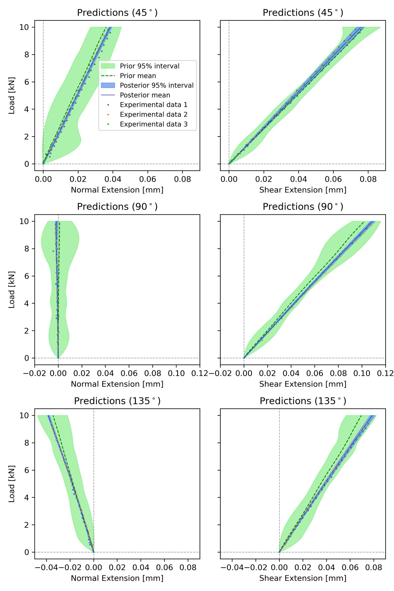{width="5.619937664041995in" height="8.429907042869642in"}

. Prediction of load-extension curves with latent bias $b_{E_{1}}$.

Posterior predictions of load-extension curves that account for the latent bias, $_{_{}}$, are shown in [Figure 12](#_Ref148946705). The predictions are similar to those in [Figure 9](#_Ref148885565), but with slightly larger posterior variance (wider 95% bands in blue) caused by the additional uncertainty introduced by the latent biases $b_{E_{1}}$. The quantitative differences between posterior and prior predictions are shown in Table 6 where we observe again that posterior predictions are closer to the experimental data than the prior predictions (RMSE reduced 70% on average) and the uncertainty around the posterior predictions is still considerably smaller than around the prior predictions (area reduced 92% on average).

In summary, the most attractive feature of including of the latent bias, $_{_{}}$, is that it provides an explanation for the discrepancy between prior and posterior values of $E_{1}$ at the expense of a slight increase in overall uncertainty of the generated predictions. The indication is that there may be some variation in the raw material and some manufacturing anomalies. The specimens were cut from the same panel, there may have been some differences in volume fraction across the panel. Further, X-ray computed tomography showed that some specimens had a small amounts of damage introduced by machining the holes, which also may have a small influence on *E~1~*.

+---------------+-----------+-----------------------------------------------------+-----------------------------------------------------+
|               |           | Root mean square error                              | Probability area                                    |
+:=============:+:=========:+:================:+:====================:+:=========:+:================:+:====================:+:=========:+
| Loading angle | Extension | Prior prediction | Posterior prediction | Reduction | Prior prediction | Posterior prediction | Reduction |
|               |           |                  |                      |           |                  |                      |           |
|               |           |                  |                      |           |                  |                      |           |
+---------------+-----------+------------------+----------------------+-----------+------------------+----------------------+-----------+
| 45°           | Normal    | 0.0162           | 0.0077               | 52%       | 0.1887           | 0.012                | 94%       |
|               +-----------+------------------+----------------------+-----------+------------------+----------------------+-----------+
|               | Shear     | 0.0223           | 0.0089               | 60%       | 0.1922           | 0.0142               | 93%       |
+---------------+-----------+------------------+----------------------+-----------+------------------+----------------------+-----------+
| 90°           | Normal    | 0.0145           | 0.0047               | 68%       | 0.1747           | 0.0083               | 95%       |
|               +-----------+------------------+----------------------+-----------+------------------+----------------------+-----------+
|               | Shear     | 0.0325           | 0.0059               | 82%       | 0.185            | 0.0216               | 88%       |
+---------------+-----------+------------------+----------------------+-----------+------------------+----------------------+-----------+
| 135°          | Normal    | 0.0146           | 0.0039               | 73%       | 0.1637           | 0.0101               | 94%       |
|               +-----------+------------------+----------------------+-----------+------------------+----------------------+-----------+
|               | Shear     | 0.0346           | 0.0061               | 82%       | 0.1748           | 0.0214               | 88%       |
+---------------+-----------+------------------+----------------------+-----------+------------------+----------------------+-----------+
|               | Average   |                  |                      | 70%       |                  |                      | 92%       |
+---------------+-----------+------------------+----------------------+-----------+------------------+----------------------+-----------+

: . RMSE and confidence area of predictions for load-extension curves with latent bias $b_{E_{1}}$.

3.  Results of the Bayesian inference framework with latent bias in the loading angle $b_{\alpha}$

The latent bias $b_{\alpha}$ is an attractive way of accounting for uncertainty in the experimental boundary conditions, due to the almost inevitable misalignment in the manual installation of the specimen in the MAF rig. It is also an attractive way to account for boundary condition complexities that are not included in the FE model, i.e. compliance in the friction grips. These parasitic effects are therefore modelled without changing the mechanics of the FE model, which means other types of effects can be easily accounted for, using the same model framework described in Section [3.2](#_Ref151992833)*.* The corresponding posterior and prior distributions of the physical parameters are shown in [Figure 13](#_Ref148947583), and the corresponding summary statistics in [Table 7](#_Ref148947791). A similar difference (to that in Figure 7) between the prior and posterior distributions of $E_{1}$ is observed. The posterior mean of $E_{1}$ is only slightly larger than that in [Table 1](#_Ref148880221) but slightly smaller than that in [Table 4](#_Ref148888741). It is therefore clear that the inclusion of the loading angle bias $_{}$ does not explain the difference between the prior and posterior for $E_{1}$and that small differences is mounting the specimen in the MAF have little effect on the results.

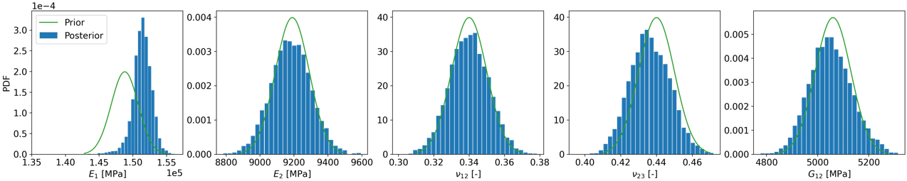{width="5.759804243219597in" height="1.151832895888014in"}

. Posterior & prior distributions of physical parameters with latent bias $b_{\alpha}$.

+-----------------------+-----------------+-----------------+------------------+------------------+------------------+
| Parameter             | $E_{1}$ \[MPa\] | $E_{2}$ \[MPa\] | $\nu_{12}$ \[-\] | $\nu_{23}$ \[-\] | $G_{12}$ \[MPa\] |
+:=====================:+:===============:+:===============:+:================:+:================:+:================:+
| Posterior mean        | 151387          | 9181            | 0.34             | 0.44             | 5051             |
|                       |                 |                 |                  |                  |                  |
| (standard deviation)  | \(1407\)        | \(117\)         | (0.01)           | (0.01)           | \(83\)           |
+-----------------------+-----------------+-----------------+------------------+------------------+------------------+
| Prior mean            | 148800          | 9190            | 0.34             | 0.44             | 5060             |
|                       |                 |                 |                  |                  |                  |
| (standard deviation)  | \(2000\)        | \(100\)         | (0.01)           | (0.01)           | \(70\)           |
+-----------------------+-----------------+-----------------+------------------+------------------+------------------+

: . Posterior & prior statistics of physical parameters with latent bias $b_{\alpha}$.

Figure 14 shows the posterior and prior distributions of latent bias $b_{\alpha}$ and Table 8 shows the posterior statistics of latent biases $_{}$ Similarly, the prior distributions of the biases all have mean of zero indicating no *a priori* bias on the average values. $_{}$It is clear that there are some biases on the loading angle in each experiment and, as described in Section 3.2, the actual experiment loading angle can be obtained by adding these biases into the nominal intended angle $\alpha$. But these biases are not significant enough to change the posterior with respect to the basic framework with no biases.

$$\alpha = 90^{\circ}$$

$$\alpha = 45^{\circ}$$

$$\alpha = 135^{\circ}$$

. Posterior & prior distributions of latent bias $b_{\alpha}$.

+----------------------+----------------------------------------------------------+------------------------------------------------------------+-------------------------------------------------+
|                      | $$\alpha = 45^{\circ}$$                                  | $$\alpha = 90^{\circ}$$                                    | $$\alpha = 135^{\circ}$$                        |
+:====================:+:==============:+:======================:+:==============:+:==============:+:================:+:======================:+:======================:+:======================:+
| Parameter            | $b_{\alpha,1}$ | $b_{\alpha,2}$ \[deg\] | $b_{\alpha,3}$ | $b_{\alpha,4}$ | $$b_{\alpha,5}$$ | $b_{\alpha,6}$ \[deg\] | $b_{\alpha,7}$ \[deg\] | $b_{\alpha,8}$ \[deg\] |
|                      |                |                        |                |                |                  |                        |                        |                        |
|                      | \[deg\]        |                        | \[deg\]        | \[deg\]        | \[deg\]          |                        |                        |                        |
+----------------------+----------------+------------------------+----------------+----------------+------------------+------------------------+------------------------+------------------------+
| Posterior mean       | 0.35           | -0.53                  | -1.30          | 0.94           | 1.55             | 1.76                   | -1.61                  | -0.32 (0.42)           |
|                      |                |                        |                |                |                  |                        |                        |                        |
| (standard deviation) | (0.40)         | (0.41)                 | (0.39)         | (0.53)         | (0.53)           | (0.55)                 | (0.41)                 |                        |
+----------------------+----------------+------------------------+----------------+----------------+------------------+------------------------+------------------------+------------------------+

: . Posterior statistics of latent bias $b_{\alpha}$.

+---------------+-----------+-----------------------------------------------------+-----------------------------------------------------+
|               |           | Root mean square error                              | Probability area                                    |
+:=============:+:=========:+:================:+:====================:+:=========:+:================:+:====================:+:=========:+
| Loading angle | Extension | Prior prediction | Posterior prediction | Reduction | Prior prediction | Posterior prediction | Reduction |
|               |           |                  |                      |           |                  |                      |           |
|               |           |                  |                      |           |                  |                      |           |
+---------------+-----------+------------------+----------------------+-----------+------------------+----------------------+-----------+
| 45°           | Normal    | 0.0163           | 0.0077               | 53%       | 0.179            | 0.0145               | 92%       |
|               +-----------+------------------+----------------------+-----------+------------------+----------------------+-----------+
|               | Shear     | 0.0222           | 0.0089               | 60%       | 0.1917           | 0.0257               | 87%       |
+---------------+-----------+------------------+----------------------+-----------+------------------+----------------------+-----------+
| 90°           | Normal    | 0.0144           | 0.0049               | 66%       | 0.1771           | 0.0202               | 89%       |
|               +-----------+------------------+----------------------+-----------+------------------+----------------------+-----------+
|               | Shear     | 0.0326           | 0.0057               | 83%       | 0.1877           | 0.0045               | 98%       |
+---------------+-----------+------------------+----------------------+-----------+------------------+----------------------+-----------+
| 135°          | Normal    | 0.0059           | 0.0039               | 34%       | 0.0905           | 0.0133               | 85%       |
|               +-----------+------------------+----------------------+-----------+------------------+----------------------+-----------+
|               | Shear     | 0.0348           | 0.0058               | 83%       | 0.1733           | 0.0257               | 85%       |
+---------------+-----------+------------------+----------------------+-----------+------------------+----------------------+-----------+
|               | Average   |                  |                      | 63%       |                  |                      | 89%       |
+---------------+-----------+------------------+----------------------+-----------+------------------+----------------------+-----------+

: . RMSE and confidence area of predictions for load-extension curves with latent bias $b_{\alpha}$.

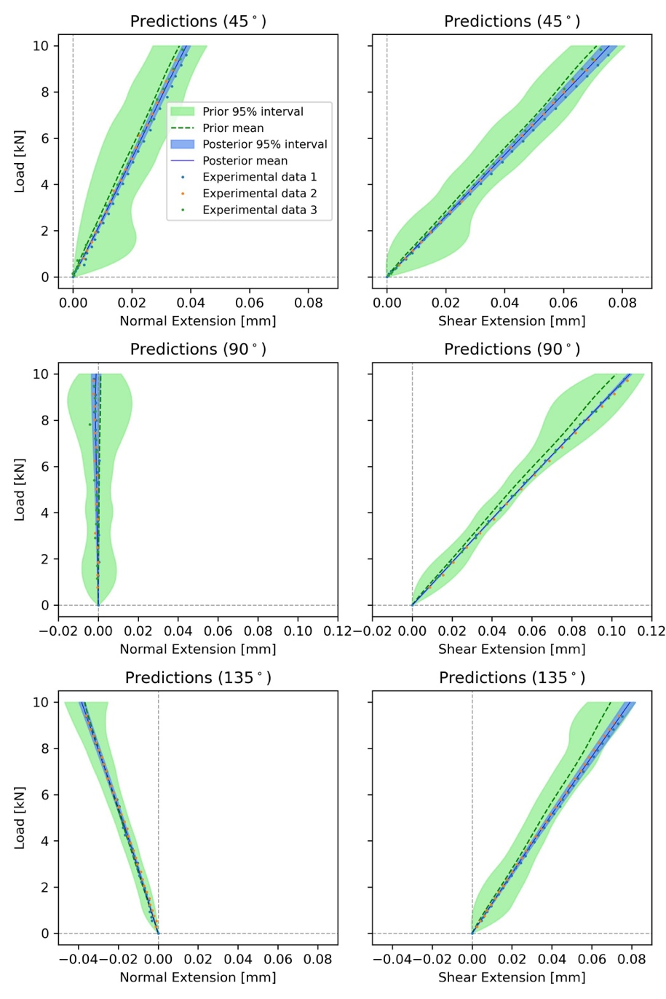{width="4.125857392825897in" height="6.188787182852144in"}

. Prediction of load-extension curves with latent bias $b_{\alpha}$.

Posterior predictions of load-extension curves that account for loading angle bias $_{}$ are shown in [Figure 15](#_Ref148950816), with corresponding quantitative values of the differences between posterior and prior predictions shown in [Table 9](#_Ref175758898). The results are similar to those in [Figure 12](#_Ref148946705). The posterior prediction of shear response for $\alpha = 90^{\circ}$ has similar variance compared to that in [Figure 7](#_Ref148885565). This is because the effective load for shear extension is $P_{x} = P\sin(\alpha)$. When $\alpha = 90^{\circ}$, a small bias in $\alpha$ has much less effect on the effective load compared to $\alpha = 45^{\circ}$ and $\alpha = 135^{\circ}$.

4.  Leave-one-out prediction

The predictions obtained in previous subsections are for cases where experimental data has been obtained. In practice, it is preferable to make predictions where no experimental data is available, i.e., predict the results of experiments that had not been conducted, which is essential to progress the concept of virtual testing. To test the performance of the posterior prediction for an unobserved experimental setting, the *leave-one-out* prediction approach is adopted. This means that one specific set of experimental data will not be included in any of Bayesian inferential frameworks described below. To qualify the performance of the prediction, posterior predictions are obtained and compared to the specific set of data that has been left out of the Bayesian analysis. Three different reduced experimental data sets are used, i.e., 1) $\alpha = 90^{\circ},\ 135^{\circ}$, 2) $\alpha = 45^{\circ},\ 135^{\circ}$ and 3) $\alpha = 45^{\circ},\ 90^{\circ}$. Hence, experimental data corresponding to a specific loading angle is left out of each of the three Bayesian analyses.

5.  Leave-one-out prediction with the basic Bayesian inference framework

The leave-one-out predictions are s$^{}^{}$$^{}^{}$$^{}^{}$hown in [Figure 16](#_Ref152943551) and the corresponding comparison summaries in Table 10. Comparing these to Figure 9 and Table 3, it is clear that RMSE performance is much more adversely affected by the data withholding (69% down to 44% average reduction) than the reduction in probability area (98% down to 92% average reduction). Specifically, the performance is substantially hampered when trying to predict normal extension in the case where the withheld loading angle dataset is 45° or 90°. The RMSE of the mean posterior prediction is virtually the same as the prior prediction (reduction of -4% and 1%) It can also be observed that, overall, prediction of shear extension is affected very little by the data withholding. This performance is consistent with the empirical evidence given in Figure 3, as for the different loading angles the shear extension changes much less than the normal extension. Hence making the prediction of the shear extension less reliant on the FE model than the predictions of normal extension. The underperformance is also partly due to the GP, which is strongly affected by the available data. Overall predictions are more affected by withholding data in terms of RMSE than in terms of probability area, where the corresponding posterior prediction uncertainty is still substantially reduced when compared to the prior prediction in all cases. $^{}$$^{}$$^{}$$^{}$

+---------------+-----------+-----------------------------------------------------+-----------------------------------------------------+
|               |           | Root mean square error                              | Probability area                                    |
+:=============:+:=========:+:================:+:====================:+:=========:+:================:+:====================:+:=========:+
| Loading angle | Extension | Prior prediction | Posterior prediction | Reduction | Prior prediction | Posterior prediction | Reduction |
|               |           |                  |                      |           |                  |                      |           |
|               |           |                  |                      |           |                  |                      |           |
+---------------+-----------+------------------+----------------------+-----------+------------------+----------------------+-----------+
| 45°           | Normal    | 0.016            | 0.0166               | -4%       | 0.179            | 0.0147               | 92%       |
|               +-----------+------------------+----------------------+-----------+------------------+----------------------+-----------+
|               | Shear     | 0.0222           | 0.0092               | 59%       | 0.1858           | 0.0105               | 94%       |
+---------------+-----------+------------------+----------------------+-----------+------------------+----------------------+-----------+
| 90°           | Normal    | 0.0149           | 0.0148               | 1%        | 0.1724           | 0.0045               | 97%       |
|               +-----------+------------------+----------------------+-----------+------------------+----------------------+-----------+
|               | Shear     | 0.0326           | 0.0084               | 74%       | 0.1832           | 0.0104               | 94%       |
+---------------+-----------+------------------+----------------------+-----------+------------------+----------------------+-----------+
| 135°          | Normal    | 0.0147           | 0.0053               | 64%       | 0.1601           | 0.0207               | 87%       |
|               +-----------+------------------+----------------------+-----------+------------------+----------------------+-----------+
|               | Shear     | 0.0348           | 0.0102               | 71%       | 0.171            | 0.0187               | 89%       |
+---------------+-----------+------------------+----------------------+-----------+------------------+----------------------+-----------+
|               | Average   |                  |                      | 44%       |                  |                      | 92%       |
+---------------+-----------+------------------+----------------------+-----------+------------------+----------------------+-----------+

: . RMSE and confidence area of leave-one-out predictions for load-extension curves with basic Bayesian inference framework.

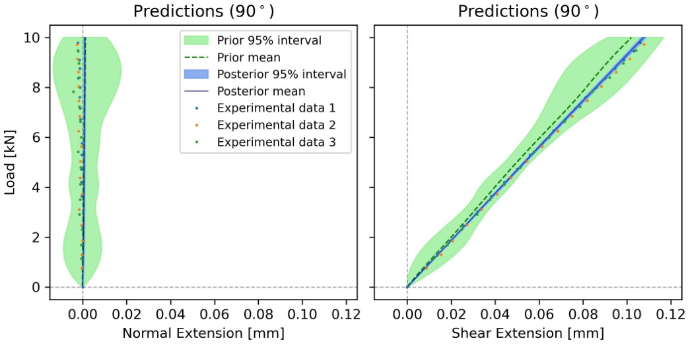

6.  Leave-one-out prediction with latent bias $_{_{}}$

$_{_{}}$The leave-one-out predictions with latent bias $_{_{}}$ $^{}^{}$$^{}^{}$$^{}^{}$are shown in Figure 17 with the corresponding comparison quantitative summaries in [Table 11](#_Ref175760463). Comparing to Figure 12 and Table 6 we can see almost the same pattern as in the basic framework without latent bias where the prediction of normal extension is much more adversely affected than the prediction of shear extension as well as the RMSE been severely affected when prediction is sought for withheld data with loading angles 45° or 90°. The leave-one-out predictions with latent bias $_{}$. are very similar very similar to those with latent bias $_{_{}}$and therefore not shown here.

+---------------+-----------+-----------------------------------------------------+-----------------------------------------------------+
|               |           | Root mean square error                              | Probability area                                    |
+:=============:+:=========:+:================:+:====================:+:=========:+:================:+:====================:+:=========:+
| Loading angle | Extension | Prior prediction | Posterior prediction | Reduction | Prior prediction | Posterior prediction | Reduction |
|               |           |                  |                      |           |                  |                      |           |
|               |           |                  |                      |           |                  |                      |           |
+---------------+-----------+------------------+----------------------+-----------+------------------+----------------------+-----------+
| 45°           | Normal    | 0.0162           | 0.0161               | 1%        | 0.1887           | 0.018                | 90%       |
|               +-----------+------------------+----------------------+-----------+------------------+----------------------+-----------+
|               | Shear     | 0.0223           | 0.0091               | 59%       | 0.1922           | 0.0189               | 90%       |
+---------------+-----------+------------------+----------------------+-----------+------------------+----------------------+-----------+
| 90°           | Normal    | 0.0145           | 0.0143               | 1%        | 0.1747           | 0.0108               | 94%       |
|               +-----------+------------------+----------------------+-----------+------------------+----------------------+-----------+
|               | Shear     | 0.0325           | 0.011                | 66%       | 0.185            | 0.0196               | 89%       |
+---------------+-----------+------------------+----------------------+-----------+------------------+----------------------+-----------+
| 135°          | Normal    | 0.0146           | 0.0046               | 68%       | 0.1637           | 0.0277               | 83%       |
|               +-----------+------------------+----------------------+-----------+------------------+----------------------+-----------+
|               | Shear     | 0.0346           | 0.0106               | 69%       | 0.1748           | 0.0232               | 87%       |
+---------------+-----------+------------------+----------------------+-----------+------------------+----------------------+-----------+
|               | Average   |                  |                      | 44%       |                  |                      | 89%       |
+---------------+-----------+------------------+----------------------+-----------+------------------+----------------------+-----------+

: . RMSE and confidence area of leave-one-out predictions for load-extension curves with latent bias $b_{E_{1}}$.

7.  

$_{}$ $_{}$$^{}^{}$$^{}^{}$$^{}^{}$

$_{}$ $_{}$${}^{}^{}$${}^{}^{}$$^{}^{}$ Conclusions

Bayesian statistics are used to combine or fuse experimental data obtained from a complex multidirectional composite component with deterministic predictions of a corresponding Finite Element model. The approach generates predictions of future experiments in a Modified Arcan Fixture (MAF) that applies multiaxial loading to a test specimen. The predictions provide normal and shear extension, with accompanied probabilistic uncertainty, and in turn confidence in the material properties used in the model.

It is shown that the Gaussian process can run effectively with limited numbers of FE simulation, and therefore able to reduce computational cost account. Moreover, the generated predictions of shear extension are close in a probabilistic sense to the experimental data even when some of the data was withheld. On the other hand, predictions are much more dependent on the amount of experimental data when predicting normal extension. This is because the overall variability in normal extension values for different loading angles is considerably larger both in observed experimental data as well as predicted by the FE model used.

The new approach presented in the paper shows how the Bayesian framework provides a valuable tool that paves the way to generate virtual tests while providing a measure of the uncertainty associated with the prediction. It is demonstrated that through the introduction of latent bias, the Bayesian predictions are able to account for heterogeneity in the material properties of the specimens tested; particularly variation in Young's modulus in the fibre direction (*E~1~*) from specimen to specimen. The Bayesian statistics were able to provide a representative value for *E~1~* that could be used in future models with corresponding statistical uncertainty. The introduction of latent bias also showed that small variations in the MAF experimental boundary conditions had little effect on the materials property predictions.

$_{}$ For future work the Bayesian framework described in the paper allows for a continuous update in the predictions when new experimental results are available. In such cases, the posterior probability distributions obtained will become the prior distributions which can be combined with the new experimental data via Bayes' theorem. Furthermore, in future work the Bayesian framework will used to determine the optimal set of next experiments according to a specified utility or cost functions as described in \[[29](#_ENREF_29), [42](#_ENREF_42)\]. Finally, the probabilistic framework presented in the paper can be modified to suit other specimen configurations and experiments by changing the corresponding FE model as well as adding a corresponding latent bias in the appropriate input parameters.

Questions:

- Looking at Table 3, 6, and 9 there is no improvement of the mean predictions, but an increase in uncertainty when latent bias is introduced. What does that tell us?

- In Table 3, 6, 9, why are there differecnes in the priors? Are they not all the same?

- Acknowledgements

This work was supported by the EPSRC Programme Grant 'Certification for Design -- Reshaping the Testing Pyramid' (CerTest, EP/S017038/1). The support received is gratefully acknowledged.

Reference

[]{#_ENREF_1 .anchor}\[1\] MIL-HDBK-17-3F: Composite Materials Handbook, Volume 3 - Polymer Matrix Composites Materials Usage, Design, and Analysis, U.S. Department of Defense, 2002.

[]{#_ENREF_2 .anchor}\[2\] J. Rouchon, Certification of large airplane composite structures, recent progress and new trends in compliance philosophy, in: In Proceedings of the 17th ICAS Congress, Stockholm, Sweden 1990, pp. 1439-1447.

[]{#_ENREF_3 .anchor}\[3\] M.G. Ostergaard, A.R. Ibbotson, O.L. Roux, A.M. Prior, Virtual testing of aircraft structures, CEAS Aeronautical Journal, 1 (2011) 83-103.

\[4\] J. LLorca, C. González, J.M. Molina-Aldareguía, J. Segurado, R. Seltzer, F. Sket, M. Rodríguez, S. Sádaba, R. Muñoz, L.P. Canal, Multiscale modeling of composite materials: a roadmap towards virtual testing, Advanced Materials, 23 (2011) 5130-5147.

\[5\] C.S. Lopes, C. González, O. Falcó, F. Naya, J. Llorca, B. Tijs, Multiscale virtual testing: the roadmap to efficient design of composites for damage resistance and tolerance, CEAS Aeronautical Journal, 7 (2016) 607-619.

\[6\] O. Falcó, R.L. Ávila, B. Tijs, C.S. Lopes, Modelling and simulation methodology for unidirectional composite laminates in a Virtual Test Lab framework, Composite Structures, 190 (2018) 137-159.

[]{#_ENREF_7 .anchor}\[7\] D.J. Wagg, K. Worden, R.J. Barthorpe, P. Gardner, Digital twins: State-of-the-art and future directions for modeling and simulation in engineering dynamics applications, ASCE-ASME J Risk and Uncert in Engrg Sys Part B Mech Engrg, 6 (2020).

[]{#_ENREF_8 .anchor}\[8\] A.S. Desai, N. N, S. Adhikari, S. Chakraborty, Enhanced multi-fidelity modeling for digital twin and uncertainty quantification, Probabilistic Engineering Mechanics, 74 (2023) 103525.

[]{#_ENREF_9 .anchor}\[9\] C. Gogu, W. Yin, R. Haftka, P. Ifju, J. Molimard, R. Le Riche, A. Vautrin, Bayesian identification of elastic constants in multi-directional laminate from moiré interferometry displacement fields, Experimental Mechanics, 53 (2013) 635-648.

\[10\] E.B. Albuquerque, C. Guzman, L.A. Borges, D.A. Castello, A Bayesian framework for the calibration of cohesive zone models, The Journal of Adhesion, 94 (2018) 255-277.

\[11\] S. Dobrilla, M. Lunardelli, M. Nikolić, D. Lowke, B. Rosić, Bayesian inference of mesoscale mechanical properties of mortar using experimental data from a double shear test, Computer Methods in Applied Mechanics and Engineering, 409 (2023) 115964.

[]{#_ENREF_12 .anchor}\[12\] C. Li, S. Mahadevan, Y. Ling, S. Choze, L. Wang, Dynamic Bayesian network for aircraft wing health monitoring digital twin, AIAA Journal, 55 (2017) 930-941.

\[13\] M. Liao, G. Renaud, Y. Bombardier, Airframe digital twin technology adaptability assessment and technology demonstration, Engineering Fracture Mechanics, 225 (2020) 106793.

\[14\] M.G. Kapteyn, J.V.R. Pretorius, K.E. Willcox, A probabilistic graphical model foundation for enabling predictive digital twins at scale, Nature Computational Science, 1 (2021) 337-347.

[]{#_ENREF_15 .anchor}\[15\] P. Congdon, Applied Bayesian Modelling, John Wiley & Sons, 2003.

[]{#_ENREF_16 .anchor}\[16\] D. Higdon, M. Kennedy, J.C. Cavendish, J.A. Cafeo, R.D. Ryne, Combining field data and computer simulations for calibration and prediction, SIAM Journal on Scientific Computing, 26 (2004) 448-466.

[]{#_ENREF_17 .anchor}\[17\] A. O\'Hagan, Curve fitting and optimal design for prediction, Journal of the Royal Statistical Society. Series B (Methodological), 40 (1978) 1-42.

[]{#_ENREF_18 .anchor}\[18\] S. Jerome, J.W. William, J.M. Toby, P.W. Henry, Design and analysis of computer experiments, Statistical Science, 4 (1989) 409-423.

[]{#_ENREF_19 .anchor}\[19\] K.W. Gan, T. Laux, S.T. Taher, J.M. Dulieu-Barton, O.T. Thomsen, A novel fixture for determining the tension/compression-shear failure envelope of multidirectional composite laminates, Composite Structures, 184 (2018) 662-673.

[]{#_ENREF_20 .anchor}\[20\] J. Holmes, S. Sommacal, R. Das, Z. Stachurski, P. Compston, Digital image and volume correlation for deformation and damage characterisation of fibre-reinforced composites: A review, Composite Structures, 315 (2023) 116994.

[]{#_ENREF_21 .anchor}\[21\] T. Laux, K.W. Gan, R.P. Tavares, C. Furtado, A. Arteiro, P.P. Camanho, O.T. Thomsen, J.M. Dulieu-Barton, Modelling damage in multidirectional laminates subjected to multi-axial loading: Ply thickness effects and model assessment, Composite Structures, 266 (2021) 113766.

[]{#_ENREF_22 .anchor}\[22\] T. Laux, K.W. Gan, J.M. Dulieu-Barton, O.T. Thomsen, Ply thickness and fibre orientation effects in multidirectional composite laminates subjected to combined tension/compression and shear, Composites Part A: Applied Science and Manufacturing, 133 (2020) 105864.

[]{#_ENREF_23 .anchor}\[23\] T. Laux, R.C. Bullock, O.T. Thomsen, J.M. Dulieu-Barton, Lay-up effect on the open-hole shear strength of composite laminates, Composites Science and Technology, 239 (2023) 110044.

[]{#_ENREF_24 .anchor}\[24\] S.R. Hallett, B.G. Green, W.-G. Jiang, K.H. Cheung, M.R. Wisnom, The open hole tensile test: a challenge for virtual testing of composites, International Journal of Fracture, 158 (2009) 169-181.

[]{#_ENREF_25 .anchor}\[25\] MatchID, in, SciTech Pty Ltd.

[]{#_ENREF_26 .anchor}\[26\] O. Sorkine-Hornung, M. Rabinovich, Least-Squares Rigid Motion Using SVD, <https://igl.ethz.ch/projects/ARAP/svd_rot.pdf>, (2017).

[]{#_ENREF_27 .anchor}\[27\] Abaqus/Standard in, Dassault Systèmes, 2018.

[]{#_ENREF_28 .anchor}\[28\] I. Jiménez-Fortunato, D.J. Bull, O.T. Thomsen, J.M. Dulieu-Barton, On the source of the thermoelastic response from orthotropic fibre reinforced composite laminates, Composites Part A: Applied Science and Manufacturing, 149 (2021) 106515.

[]{#_ENREF_29 .anchor}\[29\] J.M. Bernardo, A.F.M. Smith, Bayesian Theory, John Wiley & Sons, 1994.

[]{#_ENREF_30 .anchor}\[30\] A. Schöniger, T. Wöhling, L. Samaniego, W. Nowak, Model selection on solid ground: Rigorous comparison of nine ways to evaluate Bayesian model evidence, Water Resources Research, 50 (2014) 9484-9513.

[]{#_ENREF_31 .anchor}\[31\] S.P. Brooks, Markov chain Monte Carlo method and its application, Journal of the Royal Statistical Society. Series D (The Statistician), 47 (1998) 69-100.

[]{#_ENREF_32 .anchor}\[32\] D. van Ravenzwaaij, P. Cassey, S.D. Brown, A simple introduction to Markov Chain Monte--Carlo sampling, Psychonomic Bulletin & Review, 25 (2018) 143-154.

[]{#_ENREF_33 .anchor}\[33\] M.D. McKay, R.J. Beckman, W.J. Conover, A Comparison of Three Methods for Selecting Values of Input Variables in the Analysis of Output from a Computer Code, Technometrics, 21 (1979) 239-245.

[]{#_ENREF_34 .anchor}\[34\] M.D. Morris, Factorial Sampling Plans for Preliminary Computational Experiments, Technometrics, 33 (1991) 161-174.

[]{#_ENREF_35 .anchor}\[35\] D. Simpson, H. Rue, A. Riebler, T.G. Martins, S.H. Sørbye, Penalising Model Component Complexity: A Principled, Practical Approach to Constructing Priors, Statistical Science, 32 (2017) 1-28, 28.

[]{#_ENREF_36 .anchor}\[36\] C.E. Rasmussen, C.K.I. Williams, Gaussian Processes for Machine Learning, The MIT Press, 2005.

[]{#_ENREF_37 .anchor}\[37\] M. Betancourt, A conceptual introduction to Hamiltonian Monte Carlo, arXiv preprint arXiv:1701.02434, (2017).

[]{#_ENREF_38 .anchor}\[38\] W.K. Hastings, Monte Carlo Sampling Methods Using Markov Chains and Their Applications, Biometrika, 57 (1970) 97-109.

[]{#_ENREF_39 .anchor}\[39\] M.D. Hoffman, A. Gelman, The No-U-Turn sampler: adaptively setting path lengths in Hamiltonian Monte Carlo, J. Mach. Learn. Res., 15 (2014) 1593-1623.

[]{#_ENREF_40 .anchor}\[40\] D. Phan, N. Pradhan, M. Jankowiak, Composable effects for flexible and accelerated probabilistic programming in NumPyro, arXiv preprint arXiv:1912.11554, (2019).

[]{#_ENREF_41 .anchor}\[41\] E. Bingham, J.P. Chen, M. Jankowiak, F. Obermeyer, N. Pradhan, T. Karaletsos, R. Singh, P. Szerlip, P. Horsfall, N.D. Goodman, Pyro: Deep universal probabilistic programming, The Journal of Machine Learning Research, 20 (2019) 973-978.

[]{#_ENREF_42 .anchor}\[42\] E.G. Ryan, C.C. Drovandi, J.M. McGree, A.N. Pettitt, A Review of Modern Computational Algorithms for Bayesian Optimal Design, International Statistical Review, 84 (2016) 128-154.
